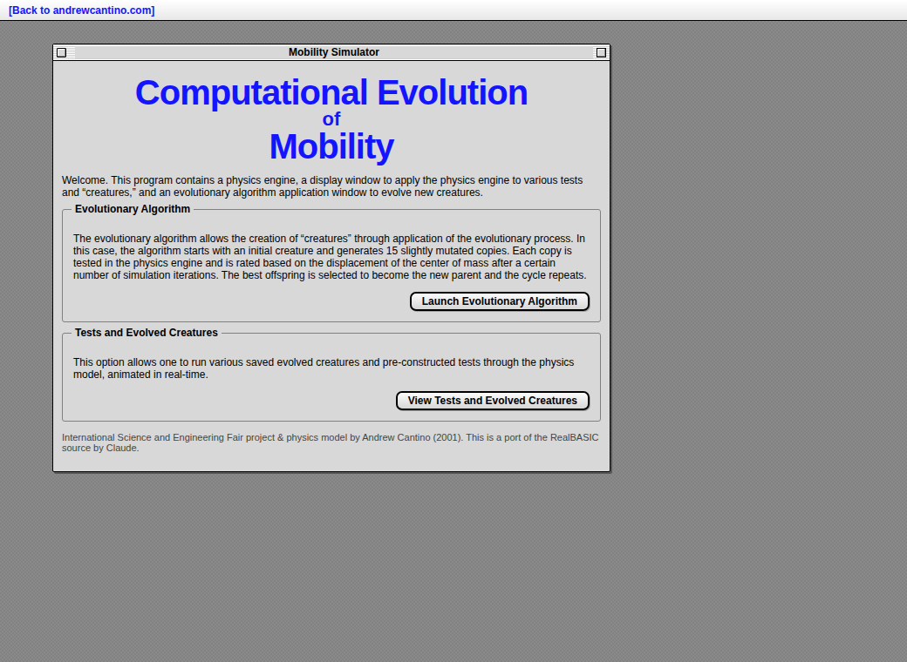
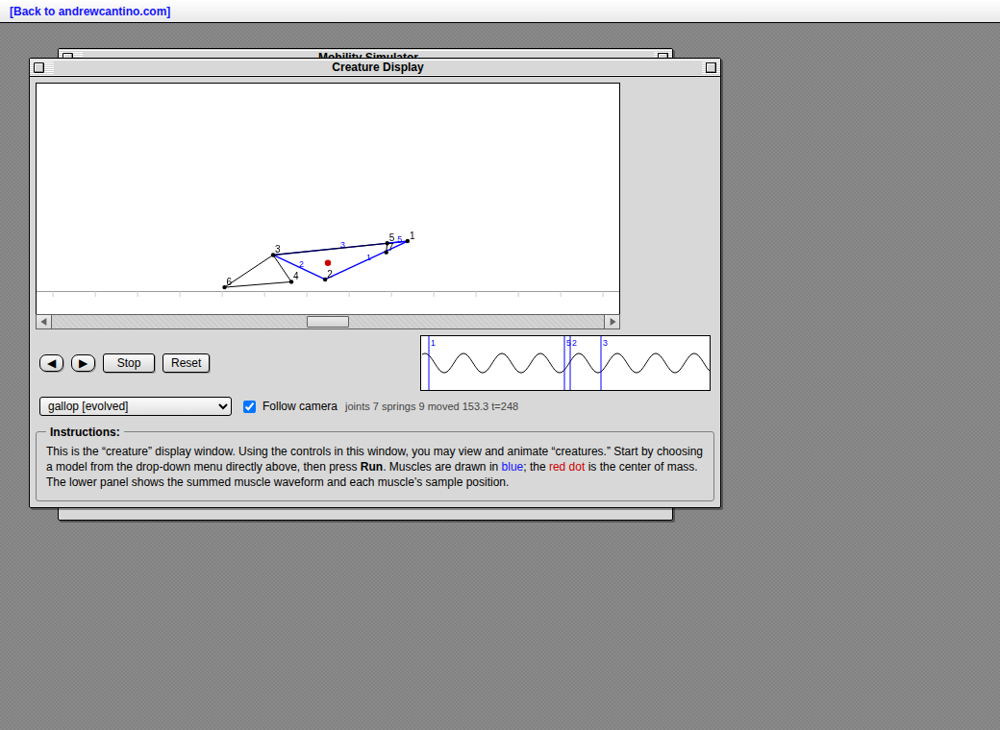
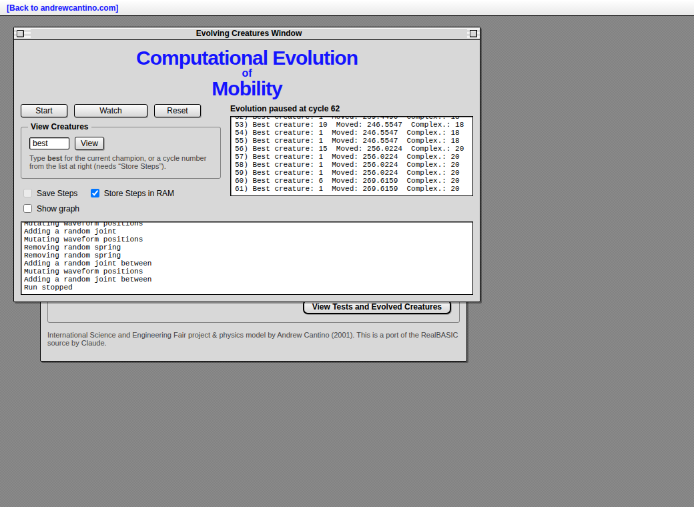

# Computational Evolution of Mobility

A faithful JavaScript/HTML port of a RealBASIC program written in 2001 for the
international science fair. The original (Mac, RealBASIC) is a **spring / joint /
muscle physics simulator** paired with an **evolutionary algorithm** that breeds
2‑D "creatures" which learn to move — inspired by Sodaplay's Sodaconstructor.

Open **`index.html`** in any modern browser. No build step, no server: the app
runs straight from `file://`.

📄 **The full write-up:** [Computational Evolution of Mobility — ISEF report
(2001)](original/ISEF-report.pdf) — the project's introduction, experiment,
results and discussion.



## What it does

* **Physics engine** — joints (point masses) connected by Hooke's‑law springs,
  with gravity, air drag, ground friction and floor bounce. Some springs are
  **muscles**: their rest length is driven by a sum of sine waveforms, so the
  creature actuates and moves.
* **Creature Display** — load a test or evolved creature and watch it animate in
  real time. Muscles are blue, the red dot is the center of mass, and the lower
  panel shows the summed muscle waveform plus each muscle's sample position
  (exactly as in the 2001 UI). A follow‑camera (default on) keeps walkers in
  view; turn it off for the original fixed view and use the **horizontal
  scrollbar** under the canvas to chase a creature across the world — the same
  control the original had (`CreatureDisplay.ScrollBar1`, which scrolled in
  ±100‑unit steps). Here it pans the camera rather than shifting the joints, so
  it doesn't disturb the physics or the distance read‑out.
* **Evolving Creatures Window** — a `(1 + 15)` hill‑climber: from one parent it
  spawns 15 mutated copies, scores each by how far its center of mass travels in
  the physics model, keeps the best, and repeats. Live stats, an animated
  "Watch" panel, and the Displacement‑vs‑Complexity graph are all reproduced.
  **Start/Stop** runs or pauses (and *continues* where it left off, like the
  original); **Reset** rebuilds the default creature and clears the log/graph —
  the original had no reset button, so this stands in for reopening the window.
  Because the parent is re‑scored every generation and only replaced when an
  offspring beats it, the best distance is **monotonic** — it plateaus for long
  stretches between lucky mutations. The status line shows the live cycle, the
  best so far and when it last improved, and the results log records only the
  cycles that actually improved (so it reads as a clean progression rather than
  the original's hundreds of identical per‑cycle lines).

| Creature Display | Evolving Creatures |
| --- | --- |
|  |  |

## Files

| File | Purpose |
| --- | --- |
| `index.html` | The three windows (intro, display, evolution), retro‑Mac styled |
| `style.css` | Classic Mac OS (System 7 / Platinum) look |
| `engine.js` | The physics engine — `Vector`, `Joint`, `Spring`, `Waveform`, `Framework` |
| `evolution.js` | The evolutionary algorithm and mutation operators |
| `app.js` | UI: rendering, animation loops, window management |
| `creatures-data.js` | Example creatures embedded as strings (so it runs offline) |
| `examples/*.txt` | The same creatures as standalone model files |
| `original/` | Provenance: the exported RealBASIC source, the [ISEF report PDF](original/ISEF-report.pdf), the science‑fair log, and the original screenshots |
| `engine.js` runs in Node too | `node test_engine.js`, `node breed.js` |

## Creature file format

Models are plain text, one element per line, exactly as the original saved them
(`MathAndMethods.saveFramework`). Joint indices are 1‑based.

```
JT x y mass locked    # a joint (point mass); locked = true|false
SP jt1 jt2 wavePos     # a spring between two joints; wavePos = -1 means "not a muscle"
WF average amplitude period phase   # a waveform: average + amplitude*cos(2π/period*(x-phase))
```

A muscle samples the **sum of all waveforms** at its fixed `wavePosition`; that
value (times a scale) is subtracted from its original rest length each tick, so
muscles at different positions contract out of phase and the creature gains a
gait.

## How the port relates to the original

Every algorithm is ported line‑for‑line from the exported RealBASIC `source
text` (kept in `original/`): the tick loop, `addSpringVectors`'s quadrant‑by‑
quadrant force directions, the `trueSetSlope` angle recovery, floor friction and
the anti‑jiggle bounce, center‑of‑mass scoring, and all seven mutation
operators. A couple of genuine bugs in the original mutations (e.g. "change
period" actually reads `phase`; `moveJoint` writes y into x twice) are
**preserved** and flagged with `[sic]` — they're part of how these creatures
really evolved in 2001.

Two notes on fidelity:

* **Exact constants.** The RealBASIC project constants (`constK`, `floorFrict`,
  `airFriction`, `tickAmt`, `waveScale`, …) aren't in an exported source
  listing, but they *are* stored in the `Mobility Simulator (revised)` RealBASIC
  project file. They were extracted byte‑for‑byte from that binary and dropped
  straight into `engine.js` — so the physics matches the original exactly:

  ```
  constK 10   absorbtion .8   airFriction .98   floorFrict .5
  floorAbsorbtion .8   waveScale 1.8   floorY 1   minPeriod 40
  tickAmt .1   numberOfCycles 2000   spawnNumber 15   PI 3.1415792 (sic)
  ```

* **Authentic example creatures.** All example creatures in `examples/` are the
  **original saved models** from the project's `Examples` folder — the evolved
  walkers, runner, galloper, wheel, sliders and worm, plus the hand‑built test
  rigs (box, two‑triangle, falling springs, throw). They are loaded verbatim.
* The original had an easter egg (`jokingMode`, which it set permanently to
  `true`): when a creature marched fully off the right edge of the view,
  `Framework.paint` drew a QuickDraw picture (`left.pict`) in the middle of the
  canvas — *"The Little Jiggly Walking Thing Has Left The Building!"* This is
  ported faithfully: it's always active, just like the original, and fires when
  a creature's center of mass and every joint clear the right edge. The only
  difference is the **Follow camera** (a new addition, default **on**): with it
  on, the creature stays centered and the joke never triggers — exactly as if
  the camera were glued to it; turn it **off** to get the original fixed-camera
  view, run a fast walker, and watch it leave the building. The **authentic
  image** is used — the project's own `original/left.pict` (a 387×139 PICT v2,
  Feb 2001) decoded to PNG and embedded in `left-pict.js`.

## Developer tools (Node)

```
node test_engine.js     # physics sanity checks (stability, save/load round-trip)
node breed.js [save]    # evolve creatures headlessly; `save` writes example files
node gen_data.js        # regenerate creatures-data.js from examples/*.txt
node smoke.js           # Playwright end-to-end smoke test of the page
node shots.js           # regenerate the screenshots above
```

— International Science and Engineering Fair project & physics model by Andrew
Cantino (2001); ported to the web (JS/HTML) by Claude.
